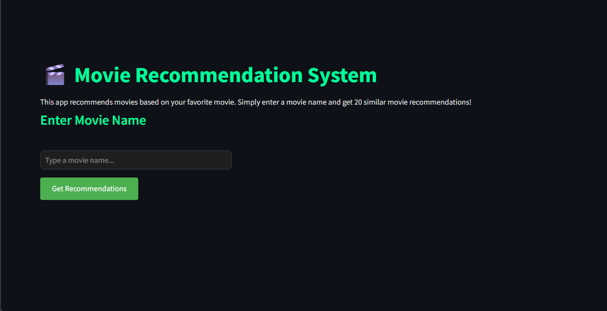
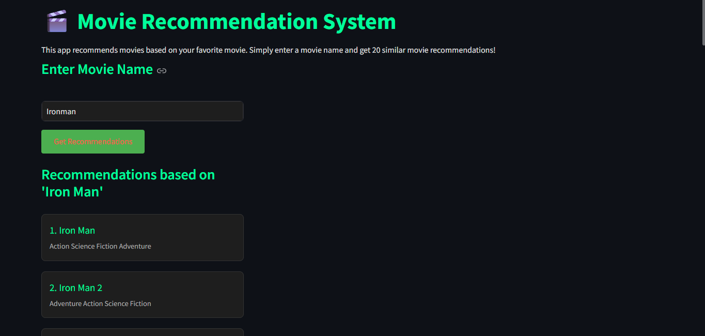

# 🎬 Movie Recommendation System


*Dark-themed Movie Recommendation System Interface*

## 📝 Overview

A sophisticated movie recommendation system built with Streamlit that uses content-based filtering to suggest similar movies based on your preferences. The system features a modern, dark-themed UI with smooth animations and interactive elements.

## 📊 Dataset

The system uses the `movies.csv` dataset that is included in this repository. This dataset contains:
- Movie titles
- Genres
- Keywords
- Cast information
- Director details
- Movie overviews
- And other relevant movie metadata

The dataset is pre-processed and ready to use. Simply ensure the `movies.csv` file is in the same directory as `app.py` when running the application.

## ✨ Features

- 🎨 Modern dark theme with soothing color scheme
- 🔍 Real-time movie recommendations
- 🎭 Detailed movie information including genres
- 🛡️ Intelligent spelling error handling
- 💫 Interactive UI elements with hover effects
- 📱 Responsive design
- ⚡ Fast and efficient recommendation engine

## 🛠️ Technical Details

### Technologies Used
- **Frontend**: Streamlit
- **Backend**: Python
- **Data Processing**: Pandas, NumPy
- **Machine Learning**: scikit-learn
- **Vectorization**: TF-IDF
- **Similarity Algorithm**: Cosine Similarity

### Features Used for Recommendations
- Movie Genres
- Keywords
- Tagline
- Cast
- Director
- Movie Overview

## 📋 Current Limitations

- The system can only recommend movies that are present in the dataset
- No real-time movie database integration
- Limited to 20 recommendations per query

## 🔮 Future Improvements

1. **Database Integration**
   - Integration with TMDB or OMDB API for real-time movie data
   - Larger movie database support
   - Regular updates to movie information

2. **Enhanced Features**
   - User authentication system
   - Save favorite movies
   - Personalized recommendations based on user history
   - Advanced filtering options
   - Movie ratings and reviews

3. **UI/UX Improvements**
   - Movie posters and trailers
   - Advanced search filters
   - Sorting options
   - User ratings and reviews
   - Social sharing features

## 🚀 Installation

1. Clone the repository:
```bash
git clone https://github.com/Anand-Ambastha/Movie-Recommendation-Model.git
cd Movie-Recommendation-Model
```

2. Create a virtual environment (recommended):
```bash
python -m venv venv
source venv/bin/activate  # On Windows: venv\Scripts\activate
```

3. Install dependencies:
```bash
pip install -r requirements.txt
```

## 💻 Usage

1. Ensure you have the `movies.csv` file in the project directory
2. Run the Streamlit app:
```bash
streamlit run app.py
```
3. Open your browser and navigate to `http://localhost:8501`
4. Enter a movie name and click "Get Recommendations"

## 📸 Screenshots

### Main Interface

*The main interface with search functionality*

### Recommendations


*Movie recommendations with genre information*

## 🤝 Contributing

Contributions are welcome! Please feel free to submit a Pull Request. For major changes, please open an issue first to discuss what you would like to change.


## 🙏 Acknowledgments

- Streamlit for the amazing web framework
- scikit-learn for the machine learning capabilities

## 📞 Contact
anandambastha72@gmail.com

For any queries or suggestions, please open an issue in the repository.

---

⭐ Star this repository if you find it useful! 
